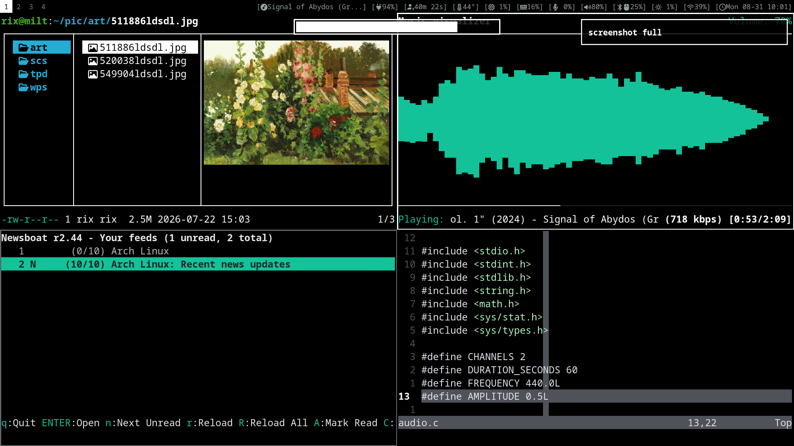

# dotfiles



<p align="center">
  <a href="./README.md">English</a> |
  <a href="./README_zh.md">简体中文</a>
</p>

> [!NOTE]
> - Configure as minimalist as possible
> - The warehouse has been continuously updating
> - Keyboard-centered operation

## [Arch Linux](https://archlinux.org) and [Sway](https://swaywm.org)
I use Arch Linux and Sway as my desktop environment. Arch Linux is a minimalist and pragmatic operating system; unlike other Linux distributions, it does not provide an out-of-the-box experience. Arch Linux requires you to configure most things yourself, which is very interesting for DIY users. Sway is the Wayland migration of i3 under Xorg. It is user-friendly in terms of configuration and is fully compatible with i3 configurations, so you can directly copy your i3 configuration to Sway.

## Install Arch Linux?
You can refer to my Arch Linux [installation](./arch_install.md) habits

## Software I Use
```sh
# Check pkglist.txt within the repository to view my installed software
# Redirect pkglist.txt into pacman to install the listed packages
pacman -S --needed - < pkglist.txt
```

## How to Use?
```sh
# Clone this repository
git clone https://github.com/bin541/dotfiles.git

# Enter the repository directory
cd ~/path/dotfiles

# Use stow to manage configurations
# Create a soft link
stow --adopt -t ~ .

# Delete a soft link
stow -D -t ~ .
```

## License
[GNU GPL 3.0](./LICENSE)
```sh
# @author bin
```
