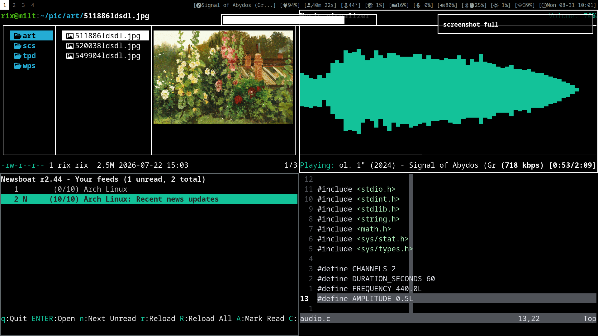

# dotfiles



<p align="center">
  <a href="./README.md">English</a> |
  <a href="./README_zh.md">简体中文</a>
</p>

> [!NOTE]
> - Configure as minimalist as possible
> - The warehouse has been continuously updating
> - Keyboard-centered operation

## [Arch Linux](https://archlinux.org) and [Sway](https://swaywm.org)
I use Arch Linux and Sway as my desktop environment. Arch Linux is a minimalist and pragmatic operating system; unlike other Linux distributions, it does not provide an out-of-the-box experience. Arch Linux requires you to configure most things yourself, which is very interesting for DIY users. Sway is the Wayland migration of i3 under Xorg. It is user-friendly in terms of configuration and is fully compatible with i3 configurations, so you can directly copy your i3 configuration to Sway.

## Install Arch Linux?
You can refer to my Arch Linux [installation](./arch_install.md) habits

## Software I Use
```sh
# Check pkgs.list within the repository to view my installed software
cat pkgs.list | less

# Redirect pkgs.list into pacman to install the listed packages
pacman -S --needed - < pkgs.list
```

| | |
|:---|:---|
| Operating system | Arch Linux |
| Shell | bash |
| Display protocol | wayland |
| Desktop environment | sway |
| Terminal | foot |
| Text editor | neovim |
| File manager | lf |
| Status bar | i3status-rust |
| Input method | fcitx5 |
| Audio service | pipewire |
| Audio control | wiremix |
| Bluetooth | bluetui |
| Screen backlight control | brightnessctl - ddcutil |
| Screenshot | grim - slurp |
| Progress bar | wob |
| Notifications | mako - libnotify |
| System monitor | btop |
| Network manager | networkmanager |
| Firewall | ufw |
| Browser | librewolf - w3m |
| RSS reader | newsboat |
| Music player | ncmpcpp - mpc - mpd |
| Video player | mpv |
| Image viewer | swayimg |
| Screen recording | wf-recorder - obs |
| Virtualization | libvirt - qemu-base - virt-manager |
| Keyboard remapping | keyd |
| Fonts | noto-fonts-cjk - ttf-nerd-fonts-symbols-mono |
| Local AI | ollama |
| AI agent | openai-codex |
| Dotfile management | stow |
| File sync | rsync |
| Android debugging | android-tools - scrcpy |
| Android file transfer | android-file-transfer |
| Version control | git |
| Archive compression/extraction | ouch |
| Power management | tlp |
| Clipboard | wl-clipboard |
| Secure boot | sbctl |
| Wallpaper | swaybg |
| Screen lock | swaylock |
| Idle management | swayidle |
| Typing practice | ttyper |
| Launcher | wmenu |
| QR code scanning | zbar |

## How to Use?
```sh
# Clone this repository
git clone https://github.com/bin541/dotfiles.git

# Enter the repository directory
cd ~/path/dotfiles

# Use stow to manage configurations
# Please back up your existing configuration; files will be overwritten
# Create a soft link
stow --adopt -t ~ .

# Delete a soft link
stow -D -t ~ .
```

## License
[GNU GPL 3.0](./LICENSE)
```sh
# @author bin
```
